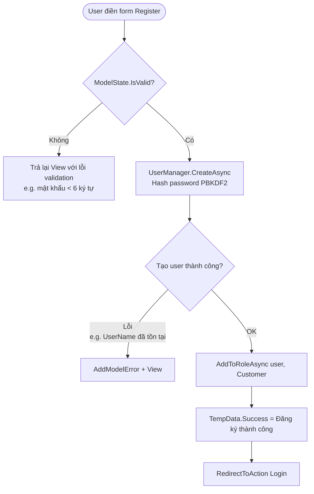
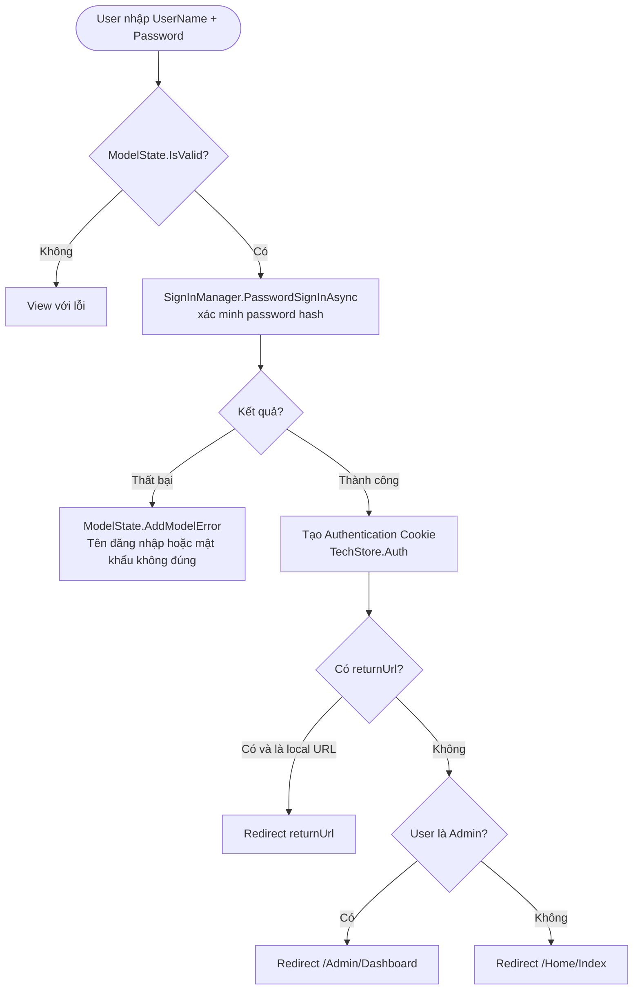
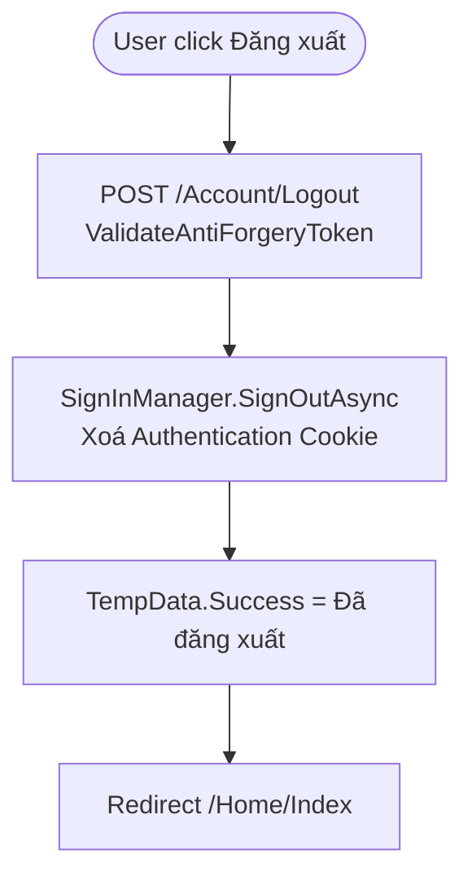
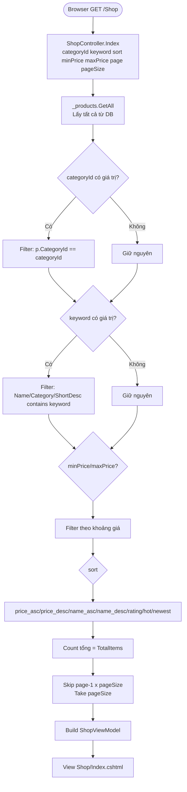
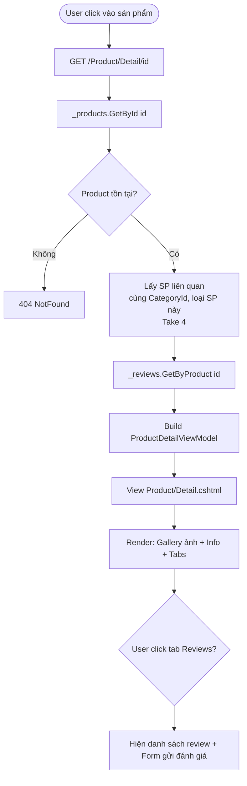
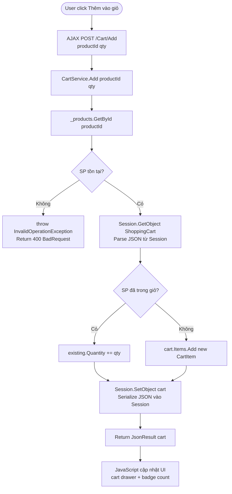
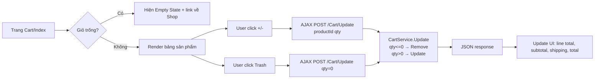
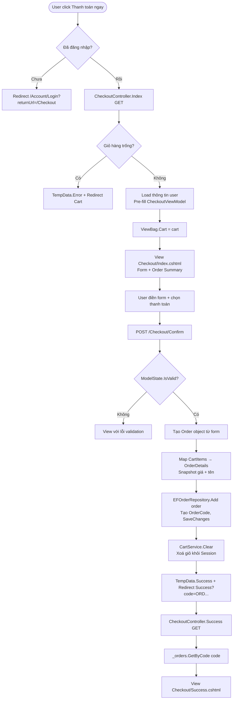
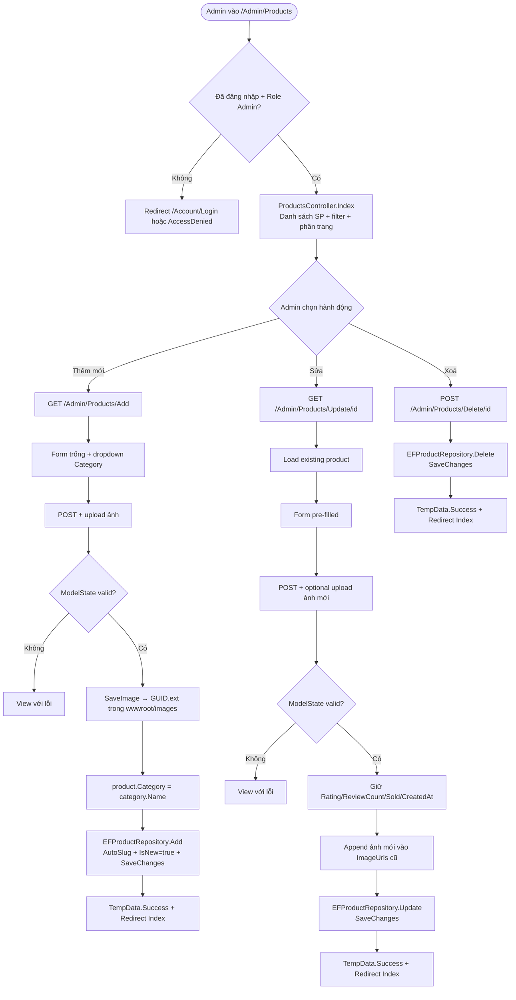
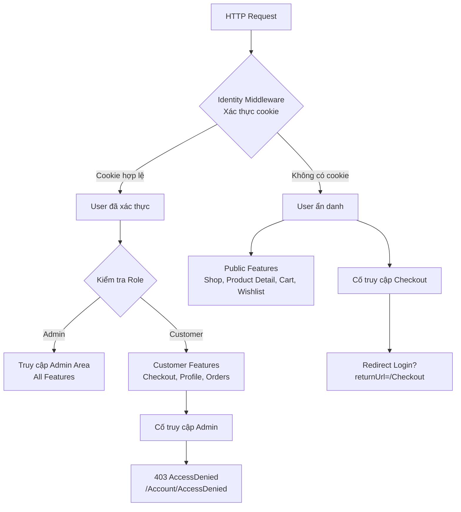

# BUSINESS FLOW — Phân tích nghiệp vụ TechStore

> Phân tích 6 luồng chính của hệ thống, có sơ đồ Mermaid cho từng luồng.

---

## Luồng 1: Đăng ký / Đăng nhập / Đăng xuất

### 1A. Đăng ký tài khoản mới

**Files liên quan:**
- `Controllers/AccountController.cs` — `Register GET/POST`
- `Views/Account/Register.cshtml`
- `Models/AppUser.cs` — `RegisterViewModel`
- `Data/DbSeeder.cs` — seed roles



**Chi tiết:**
1. User POST `RegisterViewModel` gồm: FullName, UserName, Email, Password, ConfirmPassword
2. Server validate: `[Required]`, `[EmailAddress]`, `[StringLength]`, `[Compare]`
3. `UserManager.CreateAsync(user, password)` — Identity **tự hash password** bằng PBKDF2 với salt ngẫu nhiên → lưu vào `AspNetUsers.PasswordHash`
4. Gán role "Customer" qua `AspNetUserRoles`
5. Redirect về Login — **chưa auto-login** sau đăng ký

---

### 1B. Đăng nhập



**Cookie Authentication:**
- Cookie name: `TechStore.Auth` (`Program.cs:35`)
- Expire: 7 ngày (`ExpireTimeSpan = TimeSpan.FromDays(7)`)
- `SlidingExpiration = true`: mỗi request gia hạn thêm 7 ngày
- `HttpOnly = true` (mặc định): JavaScript không đọc được cookie

**`returnUrl` security:** `Url.IsLocalUrl(returnUrl)` kiểm tra URL là local (cùng domain) trước khi redirect — chống **Open Redirect Attack**.

---

### 1C. Đăng xuất



**Tại sao Logout phải POST?** Nếu dùng GET, kẻ tấn công có thể nhúng `` vào trang khác → CSRF logout. POST + CSRF token ngăn chặn điều này.

---

## Luồng 2: Xem danh sách sản phẩm và tìm kiếm/lọc

**Files liên quan:**
- `Controllers/ShopController.cs`
- `Views/Shop/Index.cshtml`
- `Models/ShopViewModel.cs`



**Pagination logic:**
```
page=1, pageSize=12: Skip(0).Take(12) → items 1-12
page=2, pageSize=12: Skip(12).Take(12) → items 13-24
TotalPages = Math.Ceiling(TotalItems / 12)
```

**URL ví dụ:**
```
/Shop?categoryId=1&keyword=gaming&sort=price_asc&minPrice=20000000&maxPrice=60000000&page=2
```

---

## Luồng 3: Xem chi tiết sản phẩm

**Files liên quan:**
- `Controllers/ProductController.cs`
- `Views/Product/Detail.cshtml`
- `Models/ShopViewModel.cs` — `ProductDetailViewModel`



**Gallery ảnh:** Kết hợp `Product.ImageUrl` (ảnh chính) + `Product.ImageUrls` (danh sách ảnh phụ). Click thumbnail → đổi ảnh chính. Hover → zoom 1.6x.

---

## Luồng 4: Thêm vào giỏ hàng và quản lý giỏ

**Files liên quan:**
- `Controllers/CartController.cs`
- `Services/CartService.cs`
- `Services/SessionExtensions.cs`
- `Views/Cart/Index.cshtml`
- `Views/Shared/_Layout.cshtml` (cart drawer)



**Session flow chi tiết:**
```
Browser Request → Server
  ↓
Session middleware đọc Cookie "TechStore.Session"
  ↓
Tìm session data trong DistributedMemoryCache
  ↓
CartService.GetCart() gọi Session.GetObject<ShoppingCart>
  ↓
SessionExtensions.GetObject: Session.GetString(key) → JSON string
  ↓
JsonSerializer.Deserialize<ShoppingCart>(json) → ShoppingCart object
  ↓
Thêm/sửa CartItem
  ↓
SessionExtensions.SetObject: JsonSerializer.Serialize(cart) → JSON string
Session.SetString(key, json) → lưu lại
```

**Phí vận chuyển logic (Models/Cart.cs:21):**
```csharp
public decimal ShippingFee => Subtotal >= 500_000 || Subtotal == 0 ? 0 : 30_000;
```
- Subtotal >= 500K → Miễn phí
- Subtotal = 0 (giỏ trống) → 0
- Subtotal < 500K → 30.000đ

**Quản lý giỏ hàng (trang Cart/Index):**



---

## Luồng 5: Đặt hàng (Checkout)

**Files liên quan:**
- `Controllers/CheckoutController.cs` — `[Authorize]`
- `Views/Checkout/Index.cshtml`, `Success.cshtml`
- `Models/Order.cs` — `CheckoutViewModel`, `Order`, `OrderDetail`
- `Repositories/EFOrderRepository.cs`



**OrderCode generation (EFOrderRepository.cs:31):**
```csharp
order.OrderCode = $"ORD{DateTime.UtcNow:yyyyMMddHHmmss}{Random.Shared.Next(100, 999)}";
```
Format: `ORD20260605130045123` — Timestamp + random 3 chữ số → đảm bảo unique.

**Phương thức thanh toán:** Chỉ lưu code (COD/VNPay/Momo/BankTransfer) vào DB. Chưa tích hợp payment gateway thực tế — đây là MVP.

---

## Luồng 6: Admin quản lý sản phẩm (CRUD)

**Files liên quan:**
- `Areas/Admin/Controllers/ProductsController.cs` — `[Authorize(Roles = "Admin")]`
- `Areas/Admin/Views/Products/` — Index, Add, Update
- `Repositories/EFProductRepository.cs`



**Slug tự động (EFProductRepository.cs:44):**
```csharp
private static string Slugify(string s) =>
    new string(s.ToLowerInvariant()
        .Replace('đ', 'd')
        .Select(c => char.IsLetterOrDigit(c) ? c : '-').ToArray())
    .Trim('-');
```
Ví dụ: "Laptop Dell XPS 13 Plus" → `"laptop-dell-xps-13-plus"`

**Upload ảnh flow:**
```
IFormFile → SaveImage() → 
Tạo GUID filename (e.g. "a3f7b2c1.jpg") → 
Lưu vào wwwroot/images/ → 
Return "/images/a3f7b2c1.jpg" (web path)
```

**Bảo vệ data khi Update:** Admin chỉ sửa được tên, giá, mô tả, ảnh. `Rating`, `ReviewCount`, `Sold`, `CreatedAt` được lấy từ record cũ để không bị reset về 0.

---

## Tổng hợp — Luồng phân quyền


