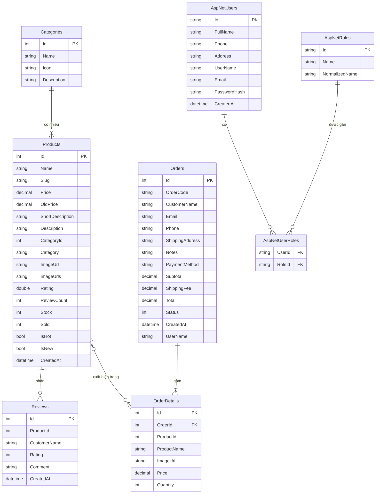

# DATABASE ANALYSIS — TechStore

> Source: `Migrations/20260605073155_Initial.cs`, `Data/ApplicationDbContext.cs`, `Data/DbSeeder.cs`

Database: **PostgreSQL** (host trên Supabase). Kết nối qua Npgsql EF Core Provider, connection string trong `appsettings.json`.

---

## Tổng quan các bảng

| # | Tên bảng | Nhóm | Mô tả |
|---|---|---|---|
| 1 | `Products` | Business | Sản phẩm bán hàng |
| 2 | `Categories` | Business | Danh mục sản phẩm |
| 3 | `Orders` | Business | Đơn hàng của khách |
| 4 | `OrderDetails` | Business | Chi tiết từng dòng trong đơn hàng |
| 5 | `Reviews` | Business | Đánh giá sản phẩm của khách |
| 6 | `AspNetUsers` | Identity | Tài khoản người dùng |
| 7 | `AspNetRoles` | Identity | Vai trò (Admin, Customer) |
| 8 | `AspNetUserRoles` | Identity | Gán vai trò cho user |
| 9 | `AspNetUserClaims` | Identity | Claims của user |
| 10 | `AspNetRoleClaims` | Identity | Claims của role |
| 11 | `AspNetUserLogins` | Identity | External login providers |
| 12 | `AspNetUserTokens` | Identity | Token xác thực (reset password...) |
| 13 | `__EFMigrationsHistory` | System | Lịch sử migration của EF Core |

---

## Chi tiết từng bảng

### 1. Bảng `Products`

**Chức năng:** Lưu trữ thông tin tất cả sản phẩm bán trên store.

| Cột | Kiểu PostgreSQL | Nullable | Ý nghĩa |
|---|---|---|---|
| `Id` | `integer` (IDENTITY) | NOT NULL | Khóa chính, tự tăng |
| `Name` | `character varying(150)` | NOT NULL | Tên sản phẩm (tối đa 150 ký tự) |
| `Slug` | `text` | NULL | URL-friendly name, ví dụ: `laptop-dell-xps-13-plus` |
| `Price` | `numeric` | NOT NULL | Giá hiện tại (VND) |
| `OldPrice` | `numeric` | NULL | Giá gốc (nếu đang giảm giá) |
| `ShortDescription` | `character varying(280)` | NULL | Mô tả ngắn hiển thị trên card |
| `Description` | `text` | NULL | Mô tả chi tiết đầy đủ |
| `CategoryId` | `integer` | NOT NULL | Khóa ngoại logic tới Categories.Id |
| `Category` | `text` | NULL | Tên danh mục (denormalized, lưu thẳng) |
| `ImageUrl` | `text` | NULL | Đường dẫn ảnh đại diện |
| `ImageUrls` | `text` | NULL | Mảng đường dẫn ảnh phụ, lưu dưới dạng JSON string |
| `Rating` | `double precision` | NOT NULL | Điểm đánh giá trung bình (0–5) |
| `ReviewCount` | `integer` | NOT NULL | Tổng số đánh giá |
| `Stock` | `integer` | NOT NULL | Số lượng tồn kho |
| `Sold` | `integer` | NOT NULL | Số lượng đã bán |
| `IsHot` | `boolean` | NOT NULL | Đánh dấu sản phẩm HOT |
| `IsNew` | `boolean` | NOT NULL | Đánh dấu sản phẩm MỚI |
| `CreatedAt` | `timestamp with time zone` | NOT NULL | Thời điểm tạo sản phẩm |

**Khóa chính:** `Id`

**Lưu ý quan trọng:**
- `ImageUrls` lưu dạng JSON string ví dụ: `["/images/a.svg","/images/b.svg"]`. EF Core tự serialize/deserialize qua `HasConversion` trong `ApplicationDbContext.cs:28`.
- `DiscountPercent` là computed property, **không** lưu trong DB (`.Ignore(p => p.DiscountPercent)` tại `ApplicationDbContext.cs:24`).
- `CategoryId` không có foreign key constraint trong migration — đây là soft reference.

---

### 2. Bảng `Categories`

**Chức năng:** Danh mục phân loại sản phẩm (Laptop, Desktop, Phụ kiện, Màn hình).

| Cột | Kiểu PostgreSQL | Nullable | Ý nghĩa |
|---|---|---|---|
| `Id` | `integer` (IDENTITY) | NOT NULL | Khóa chính, tự tăng |
| `Name` | `character varying(50)` | NOT NULL | Tên danh mục |
| `Icon` | `text` | NOT NULL | Bootstrap Icons class, ví dụ: `bi-laptop` |
| `Description` | `character varying(160)` | NULL | Mô tả ngắn danh mục |

**Khóa chính:** `Id`

**Dữ liệu seed (từ `DbSeeder.cs:56`):**

| Id | Name | Icon |
|---|---|---|
| 1 | Laptop | bi-laptop |
| 2 | Desktop | bi-pc-display |
| 3 | Phụ kiện | bi-mouse2 |
| 4 | Màn hình | bi-display |

---

### 3. Bảng `Orders`

**Chức năng:** Lưu thông tin đơn hàng (header) của khách sau khi checkout.

| Cột | Kiểu PostgreSQL | Nullable | Ý nghĩa |
|---|---|---|---|
| `Id` | `integer` (IDENTITY) | NOT NULL | Khóa chính, tự tăng |
| `OrderCode` | `text` | NOT NULL | Mã đơn hàng độc nhất, ví dụ: `ORD20260605130045123` |
| `CustomerName` | `text` | NOT NULL | Tên người nhận hàng |
| `Email` | `text` | NOT NULL | Email người đặt |
| `Phone` | `text` | NOT NULL | Số điện thoại |
| `ShippingAddress` | `text` | NOT NULL | Địa chỉ giao hàng |
| `Notes` | `text` | NULL | Ghi chú thêm của khách |
| `PaymentMethod` | `text` | NOT NULL | Phương thức: COD / VNPay / Momo / BankTransfer |
| `Subtotal` | `numeric` | NOT NULL | Tổng tiền hàng (chưa ship) |
| `ShippingFee` | `numeric` | NOT NULL | Phí vận chuyển (0 nếu >= 500.000đ) |
| `Total` | `numeric` | NOT NULL | Tổng cộng = Subtotal + ShippingFee |
| `Status` | `integer` | NOT NULL | Trạng thái: 0=Pending, 1=Confirmed, 2=Shipping, 3=Completed, 4=Cancelled |
| `CreatedAt` | `timestamp with time zone` | NOT NULL | Thời điểm đặt hàng |
| `UserName` | `text` | NULL | Username của người đặt (null nếu đặt ẩn danh) |

**Khóa chính:** `Id`

**Index:** `IX_Orders_OrderCode` — UNIQUE (đảm bảo mã đơn không trùng)

**Enum OrderStatus** (từ `Models/Order.cs:6`):
```csharp
Pending = 0    // Chờ xác nhận
Confirmed = 1  // Đã xác nhận
Shipping = 2   // Đang giao
Completed = 3  // Hoàn tất
Cancelled = 4  // Đã huỷ
```

---

### 4. Bảng `OrderDetails`

**Chức năng:** Chi tiết từng sản phẩm trong đơn hàng (owned entity của Order).

| Cột | Kiểu PostgreSQL | Nullable | Ý nghĩa |
|---|---|---|---|
| `Id` | `integer` (IDENTITY) | NOT NULL | Khóa chính, tự tăng |
| `OrderId` | `integer` | NOT NULL | Khóa ngoại tới Orders.Id |
| `ProductId` | `integer` | NOT NULL | ID sản phẩm (không có FK constraint) |
| `ProductName` | `text` | NOT NULL | Tên sản phẩm tại thời điểm đặt (snapshot) |
| `ImageUrl` | `text` | NULL | Ảnh sản phẩm tại thời điểm đặt |
| `Price` | `numeric` | NOT NULL | Giá sản phẩm tại thời điểm đặt (snapshot) |
| `Quantity` | `integer` | NOT NULL | Số lượng đặt |

**Khóa chính:** `Id`

**Khóa ngoại:** `OrderId → Orders.Id` (CASCADE DELETE)

**Lý do snapshot:** Giá và tên sản phẩm được copy vào OrderDetail để đảm bảo dữ liệu lịch sử không bị ảnh hưởng khi admin sửa Product sau này.

---

### 5. Bảng `Reviews`

**Chức năng:** Đánh giá sản phẩm của khách hàng.

| Cột | Kiểu PostgreSQL | Nullable | Ý nghĩa |
|---|---|---|---|
| `Id` | `integer` (IDENTITY) | NOT NULL | Khóa chính, tự tăng |
| `ProductId` | `integer` | NOT NULL | ID sản phẩm được đánh giá |
| `CustomerName` | `character varying(80)` | NOT NULL | Tên người đánh giá |
| `Rating` | `integer` | NOT NULL | Số sao (1–5) |
| `Comment` | `character varying(1000)` | NOT NULL | Nội dung đánh giá |
| `CreatedAt` | `timestamp with time zone` | NOT NULL | Thời điểm đánh giá |

**Khóa chính:** `Id`

**Lưu ý:** Không có FK constraint tới Products. Không có FK tới AspNetUsers — khách không cần đăng nhập để đánh giá.

---

### 6. Bảng `AspNetUsers` (Identity)

**Chức năng:** Tài khoản người dùng — mở rộng từ IdentityUser với các field tùy chỉnh.

| Cột | Kiểu | Nullable | Ý nghĩa |
|---|---|---|---|
| `Id` | `text` | NOT NULL | Khóa chính (GUID string) |
| `FullName` | `character varying(120)` | NOT NULL | Họ tên đầy đủ (field tùy chỉnh) |
| `Phone` | `text` | NULL | Số điện thoại (field tùy chỉnh) |
| `Address` | `text` | NULL | Địa chỉ giao hàng mặc định (field tùy chỉnh) |
| `AvatarUrl` | `text` | NULL | URL ảnh đại diện (field tùy chỉnh) |
| `CreatedAt` | `timestamp with time zone` | NOT NULL | Ngày tạo tài khoản (field tùy chỉnh) |
| `UserName` | `character varying(256)` | NULL | Tên đăng nhập |
| `NormalizedUserName` | `character varying(256)` | NULL | UserName dạng UPPERCASE (để tìm kiếm) |
| `Email` | `character varying(256)` | NULL | Email |
| `PasswordHash` | `text` | NULL | Hash mật khẩu (PBKDF2 + SHA256 + salt) |
| `SecurityStamp` | `text` | NULL | Vô hiệu cookie khi đổi password |
| `TwoFactorEnabled` | `boolean` | NOT NULL | 2FA bật/tắt |
| `LockoutEnd` | `timestamp with time zone` | NULL | Thời điểm hết lockout |
| `AccessFailedCount` | `integer` | NOT NULL | Số lần đăng nhập sai |

**Khóa chính:** `Id`

**Tài khoản seed:**
| UserName | FullName | Role | Password |
|---|---|---|---|
| `admin` | Quản trị viên | Admin | admin123 |
| `khachhang` | Nguyễn Khách Hàng | Customer | 123456 |
| `minhtuan` | Minh Tuấn | Customer | 123456 |

---

### 7. Bảng `AspNetRoles` (Identity)

| Cột | Kiểu | Ý nghĩa |
|---|---|---|
| `Id` | `text` (GUID) | Khóa chính |
| `Name` | `character varying(256)` | Tên role: "Admin" hoặc "Customer" |
| `NormalizedName` | `character varying(256)` | UPPERCASE để tìm kiếm |
| `ConcurrencyStamp` | `text` | Optimistic concurrency |

---

### 8. Bảng `AspNetUserRoles` (Identity)

Bảng nối Many-to-Many giữa Users và Roles.

| Cột | Kiểu | Ý nghĩa |
|---|---|---|
| `UserId` | `text` | FK → AspNetUsers.Id |
| `RoleId` | `text` | FK → AspNetRoles.Id |

**Khóa chính:** `(UserId, RoleId)` — composite primary key

---

## Quan hệ giữa các bảng

### One-to-Many

| Bảng "Một" | Bảng "Nhiều" | Quan hệ |
|---|---|---|
| `Orders` | `OrderDetails` | 1 đơn hàng có nhiều dòng chi tiết |
| `AspNetRoles` | `AspNetRoleClaims` | 1 role có nhiều claims |
| `AspNetUsers` | `AspNetUserClaims` | 1 user có nhiều claims |
| `AspNetUsers` | `AspNetUserLogins` | 1 user có nhiều external logins |
| `AspNetUsers` | `AspNetUserTokens` | 1 user có nhiều tokens |

### Many-to-Many

| Bảng | Bảng nối | Bảng |
|---|---|---|
| `AspNetUsers` | `AspNetUserRoles` | `AspNetRoles` |

### Soft Reference (không có FK constraint)

| Bảng | Field | Trỏ tới |
|---|---|---|
| `Products` | `CategoryId` | `Categories.Id` |
| `Reviews` | `ProductId` | `Products.Id` |
| `OrderDetails` | `ProductId` | `Products.Id` |
| `Orders` | `UserName` | `AspNetUsers.UserName` |

---

## ERD — Entity Relationship Diagram



---

## Ghi chú về thiết kế

1. **Denormalization có chủ đích:** `Products.Category` lưu tên danh mục thẳng vào bảng Products để tránh JOIN khi query. Đây là trade-off performance vs. consistency.

2. **OrderDetail snapshot pattern:** `ProductName`, `Price`, `ImageUrl` trong OrderDetails là bản sao tại thời điểm đặt hàng — đảm bảo lịch sử đơn hàng không thay đổi dù admin sửa product.

3. **ImageUrls lưu JSON:** Thay vì tạo bảng `ProductImages` riêng, EF Core serialize `List<string>` thành JSON text. Phù hợp cho ứng dụng nhỏ, nhưng không query được bên trong field này.

4. **Soft FK cho Reviews và Products:** Không có ON DELETE CASCADE — nếu xoá product, các review vẫn còn trong DB. Cần xử lý thủ công nếu cần.
