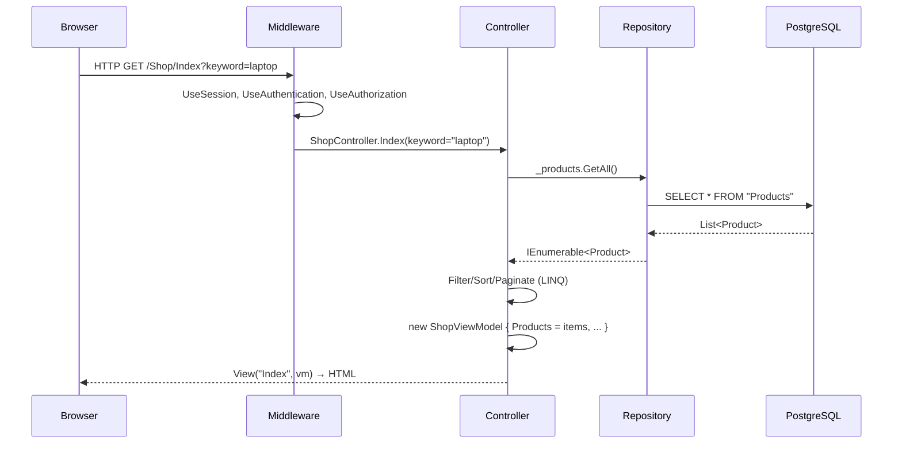
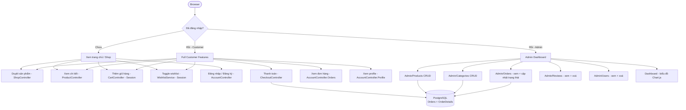

# PROJECT OVERVIEW — TechStore (WebBanHang_Bai2)

## 1. Giới thiệu dự án

**Tên dự án:** TechStore — Cửa hàng bán lẻ thiết bị công nghệ trực tuyến

**Môn học:** CMP376 — Thực hành Lập trình Web (Bài 2)

**Mục tiêu:** Xây dựng một ứng dụng web thương mại điện tử hoàn chỉnh cho phép:
- Khách hàng duyệt, tìm kiếm, lọc sản phẩm công nghệ (Laptop, Desktop, Phụ kiện, Màn hình)
- Thêm sản phẩm vào giỏ hàng và danh sách yêu thích
- Đặt hàng trực tuyến với nhiều phương thức thanh toán
- Đăng ký, đăng nhập, xem lịch sử đơn hàng
- Quản trị viên quản lý toàn bộ hệ thống qua Admin Panel

**Bài toán thực tế:** Một chuỗi bán lẻ công nghệ muốn chuyển đổi số, cần nền tảng online để tiếp cận khách hàng rộng hơn, quản lý hàng hoá tập trung và xử lý đơn hàng hiệu quả.

**Đối tượng người dùng:**
- **Khách vãng lai:** xem sản phẩm, tìm kiếm, thêm giỏ hàng (nhưng phải đăng nhập để checkout)
- **Customer (thành viên):** toàn bộ quyền của khách + đặt hàng + xem lịch sử đơn
- **Admin:** quản lý sản phẩm, danh mục, đơn hàng, người dùng, đánh giá

---

## 2. Công nghệ sử dụng

| Công nghệ | Phiên bản | Vai trò |
|---|---|---|
| **ASP.NET Core MVC** | 8.0 | Framework chính — xử lý request, routing, render view |
| **Entity Framework Core** | 8.0.11 | ORM — map C# class sang bảng PostgreSQL |
| **Npgsql** (EF Provider) | 8.0.11 | Kết nối và truy vấn PostgreSQL |
| **ASP.NET Core Identity** | 8.0.11 | Xác thực/phân quyền — quản lý user, role, password hash |
| **PostgreSQL / Supabase** | (cloud) | Cơ sở dữ liệu quan hệ lưu trữ toàn bộ data |
| **Razor Views** (.cshtml) | — | Template engine — render HTML phía server |
| **Bootstrap 5** | 5.x | CSS framework — responsive layout, components |
| **Bootstrap Icons** | 1.11.3 | Bộ icon SVG/font cho UI |
| **Chart.js** | 4.4.1 | Vẽ biểu đồ doanh thu và phân tích trên Admin Dashboard |
| **Razor Runtime Compilation** | 8.0.0 | Cho phép chỉnh sửa .cshtml không cần restart server (dev) |
| **Session (In-Memory)** | — | Lưu giỏ hàng và wishlist theo phiên làm việc |
| **System.Text.Json** | — | Serialize/Deserialize object vào/ra Session |
| **Vanilla JavaScript + jQuery** | — | AJAX calls tới CartController, toggle wishlist, UI interactions |

**Giải thích vai trò cụ thể:**

- **MVC Pattern:** Phân tách rõ ràng Model (data) — Controller (logic) — View (UI). Controller nhận request từ browser, gọi Repository để lấy data, truyền vào View để render HTML.
- **EF Core:** Thay vì viết SQL thủ công, developer viết LINQ query trên C# class. EF Core tự tạo câu SQL tương ứng và map kết quả về object.
- **Identity:** Quản lý toàn bộ vòng đời user — đăng ký, hash password (PBKDF2), cookie auth, role-based access control. Không cần tự viết cơ chế bảo mật.
- **Session:** Giỏ hàng lưu trong server-side session (cookie chứa session ID), được serialize thành JSON. Không cần login để có giỏ hàng.

---

## 3. Kiến trúc MVC

### MVC là gì?

MVC (Model - View - Controller) là design pattern chia ứng dụng web thành 3 phần:

- **Model:** Đại diện cho dữ liệu và business logic (Product, Order, Category...)
- **View:** Giao diện người dùng — file .cshtml render HTML dựa trên dữ liệu từ Controller
- **Controller:** Điều phối — nhận HTTP request, xử lý logic, gọi Repository lấy data, trả View về browser

### Luồng Request → Response

```
Browser gửi HTTP Request
        ↓
  ASP.NET Core Routing
  (Program.cs: MapControllerRoute)
        ↓
  Middleware Pipeline
  (Static Files → Session → Auth → MVC)
        ↓
  Controller Action Method
  (nhận tham số từ route/query/form)
        ↓
  Repository (IProductRepository v.v.)
        ↓
  EF Core → SQL Query → PostgreSQL
        ↓
  C# Objects (Product, Order...)
        ↓
  Controller trả View(viewModel)
        ↓
  Razor Engine render .cshtml → HTML
        ↓
  HTTP Response về Browser
```

### Mermaid Diagram — Luồng tổng quát



---

## 4. Cấu trúc thư mục

```
WebBanHang_Bai2/
├── Program.cs                  # Entry point: cấu hình DI, middleware, routing, seed DB
├── WebBanHang_Bai2.csproj      # Khai báo dependencies (NuGet packages)
├── appsettings.json            # Cấu hình connection string, logging
├── appsettings.Development.json# Cấu hình riêng cho môi trường dev
│
├── Areas/
│   └── Admin/                  # Khu vực quản trị (route: /Admin/...)
│       ├── Controllers/        # DashboardController, ProductsController, v.v.
│       └── Views/              # Views cho Admin (layout riêng _AdminLayout.cshtml)
│
├── Controllers/                # Controllers cho phía khách hàng
│   ├── AccountController.cs    # Đăng ký/đăng nhập/đăng xuất/profile
│   ├── CartController.cs       # Giỏ hàng (JSON API + View)
│   ├── CheckoutController.cs   # Thanh toán và đặt hàng
│   ├── HomeController.cs       # Trang chủ, About, Contact
│   ├── ProductController.cs    # Chi tiết sản phẩm + gửi đánh giá
│   ├── ShopController.cs       # Danh sách sản phẩm + tìm kiếm/lọc
│   └── WishlistController.cs   # Danh sách yêu thích
│
├── Data/
│   ├── ApplicationDbContext.cs # DbContext kế thừa IdentityDbContext
│   └── DbSeeder.cs             # Seed dữ liệu ban đầu (roles, users, categories, products)
│
├── Migrations/
│   └── 20260605073155_Initial.cs  # Migration tạo toàn bộ schema PostgreSQL
│
├── Models/                     # Các class dữ liệu
│   ├── Product.cs              # Sản phẩm
│   ├── Category.cs             # Danh mục
│   ├── ApplicationUser.cs      # Người dùng (kế thừa IdentityUser)
│   ├── AppUser.cs              # Legacy mock user + RegisterViewModel
│   ├── Order.cs                # Đơn hàng + OrderDetail + CheckoutViewModel
│   ├── Review.cs               # Đánh giá sản phẩm
│   ├── Cart.cs                 # ShoppingCart + CartItem (in-memory, session)
│   ├── ShopViewModel.cs        # ViewModel: ShopViewModel, ProductDetailViewModel, DashboardViewModel
│   ├── LoginViewModel.cs       # Form đăng nhập
│   └── ErrorViewModel.cs       # Trang lỗi
│
├── Repositories/               # Data access layer
│   ├── IProductRepository.cs   # Interface
│   ├── EFProductRepository.cs  # Implement với EF Core
│   ├── MockProductRepository.cs# Implement với List<> in-memory (legacy)
│   ├── ICategoryRepository.cs  # Interface
│   ├── EFCategoryRepository.cs # Implement với EF Core
│   ├── IOrderRepository.cs     # Interface + MockOrderRepository
│   ├── EFOrderRepository.cs    # Implement với EF Core
│   ├── IReviewRepository.cs    # Interface + MockReviewRepository
│   ├── EFReviewRepository.cs   # Implement với EF Core
│   └── IUserStore.cs           # Legacy (không dùng)
│
├── Services/
│   ├── CartService.cs          # Business logic giỏ hàng, đọc/ghi Session
│   ├── WishlistService.cs      # Business logic wishlist, đọc/ghi Session
│   └── SessionExtensions.cs   # Extension method SetObject/GetObject cho ISession
│
├── Views/                      # Razor Views cho customer-facing
│   ├── Shared/
│   │   ├── _Layout.cshtml      # Layout master: header, nav, footer, cart drawer
│   │   ├── _ProductCard.cshtml # Partial view: card sản phẩm dùng lại nhiều nơi
│   │   └── Error.cshtml        # Trang lỗi
│   ├── Account/                # Login, Register, Profile, Orders, AccessDenied
│   ├── Cart/Index.cshtml       # Trang giỏ hàng
│   ├── Checkout/               # Trang thanh toán + Success
│   ├── Home/                   # Index (trang chủ), About, Contact, Privacy
│   ├── Product/Detail.cshtml   # Chi tiết sản phẩm + gallery + review
│   ├── Shop/Index.cshtml       # Danh sách sản phẩm + filter + sort + phân trang
│   └── Wishlist/Index.cshtml   # Danh sách yêu thích
│
└── wwwroot/                    # Static files phục vụ trực tiếp
    ├── css/site.css            # Custom CSS (dark mode, TX components)
    ├── js/site.js              # Vanilla JS: cart drawer, wishlist toggle, toast
    ├── images/                 # Ảnh sản phẩm (SVG placeholder + ảnh upload)
    └── lib/                    # Bootstrap, jQuery (libman)
```

---

## 5. Luồng hoạt động tổng thể



**Ghi chú các điểm quan trọng:**
- Giỏ hàng và Wishlist lưu trong Session — không cần database
- Tất cả controllers Admin đều có `[Authorize(Roles = "Admin")]`
- `CheckoutController` có `[Authorize]` ở class level — cần đăng nhập mới checkout được
- `DbSeeder.SeedAsync` chạy tự động khi app khởi động, chỉ seed nếu chưa có data
