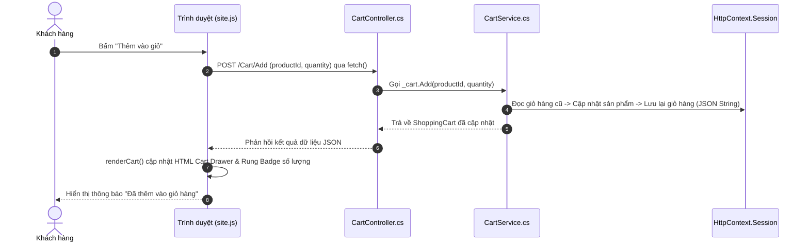
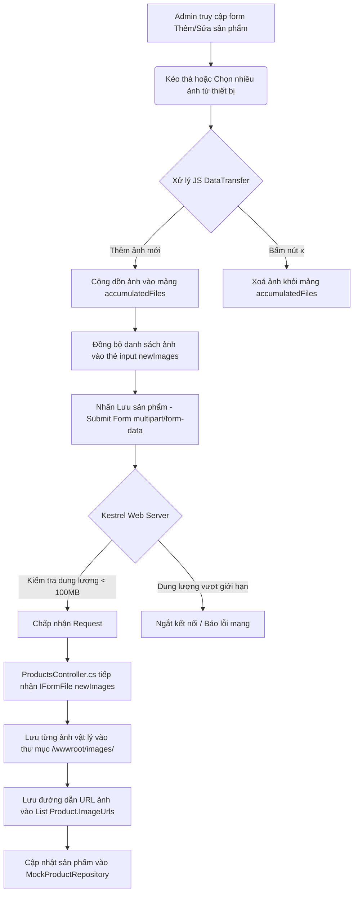

# Hướng dẫn chi tiết & Giải thích mã nguồn dự án TechStore (Bài 2)

Tài liệu này giải thích chi tiết cấu trúc thư mục, kiến trúc mã nguồn, luồng dữ liệu (Action Flow) và các kỹ thuật xử lý chính trong ứng dụng thương mại điện tử **TechStore** viết bằng **ASP.NET Core MVC 8.0**.

---

## 1. Kiến trúc tổng quan (Architecture Overview)

Dự án áp dụng mô hình kiến trúc **MVC (Model-View-Controller)** chuẩn của ASP.NET Core:
*   **Model:** Định nghĩa cấu trúc dữ liệu (`Product`, `Category`, `Order`, `AppUser`, v.v.) và các View Model phục vụ truyền dữ liệu cho giao diện.
*   **View:** Giao diện HTML hiển thị cho người dùng, sử dụng công nghệ Razor (`.cshtml`) kết hợp CSS Glassmorphism tùy biến và JavaScript xử lý tương tác bất đồng bộ (AJAX).
*   **Controller:** Tiếp nhận request từ người dùng, gọi các dịch vụ xử lý nghiệp vụ (Services/Repositories) và trả về View hoặc dữ liệu dạng JSON.

### Cơ chế lưu trữ dữ liệu (Không dùng Database vật lý)
Để đáp ứng yêu cầu *"Không làm database"* nhưng mọi nút chức năng vẫn hoạt động thực tế 100%, hệ thống sử dụng **Repository Pattern** kết hợp cấu hình **Singleton** trong `Program.cs`:
```csharp
builder.Services.AddSingleton<IProductRepository, MockProductRepository>();
builder.Services.AddSingleton<ICategoryRepository, MockCategoryRepository>();
builder.Services.AddSingleton<IOrderRepository, MockOrderRepository>();
builder.Services.AddSingleton<IReviewRepository, MockReviewRepository>();
builder.Services.AddSingleton<IUserStore, MockUserStore>();
```
*   **Ý nghĩa:** Khi đăng ký các Repository này dưới dạng `Singleton`, ASP.NET Core sẽ khởi tạo **duy nhất một thực thể (instance)** của từng class và chia sẻ thực thể này xuyên suốt toàn bộ vòng đời của ứng dụng. Do đó, khi bạn thêm sản phẩm, sửa danh mục, hay duyệt đơn hàng, dữ liệu sẽ được thay đổi trực tiếp trong các danh sách trên bộ nhớ RAM (In-memory) và được bảo toàn cho tới khi server tắt.

---

## 2. Cấu trúc thư mục dự án

```text
WebBanHang_Bai2/
├── Areas/                   # Các phân vùng lớn của hệ thống
│   └── Admin/               # Phân vùng Quản trị dành cho Administrator
│       ├── Controllers/     # Các Controller quản lý CRUD (Products, Orders, v.v.)
│       └── Views/           # Giao diện bảng điều khiển Admin và quản lý
├── Controllers/             # Các Controller dành cho khách hàng (Home, Shop, Cart, Account...)
├── Models/                  # Các lớp thực thể dữ liệu (Entities) và ViewModels
├── Properties/              # Cấu hình khởi chạy (launchSettings.json)
├── Repositories/            # Các Interface và Mock implementation của tầng truy xuất dữ liệu
├── Services/                # Các dịch vụ nghiệp vụ bổ sung (CartService, WishlistService)
├── Views/                   # Thư mục chứa giao diện Razor cho khách hàng
│   ├── Shared/              # Layout chung, Product Card, và các Partial view
│   └── _ViewImports.cshtml  # Khai báo các namespace dùng chung trong toàn bộ View
├── wwwroot/                 # Các tài nguyên tĩnh (Static Files) công khai
│   ├── css/site.css         # File định nghĩa phong cách giao diện chính (Cyberpunk Theme)
│   ├── js/site.js           # File xử lý tương tác AJAX phía Client
│   └── images/              # Lưu trữ hình ảnh sản phẩm được tải lên
├── Program.cs               # File cấu hình khởi động và Middleware của ứng dụng
└── WebBanHang_Bai2.csproj  # File cấu hình project .NET
```

---

## 3. Các luồng Action chính (Key Action Flows)

### 3.1. Luồng Giỏ hàng Realtime (AJAX Cart Flow)

Đây là tính năng tương tác bất đồng bộ (AJAX) giúp thêm, sửa, xoá sản phẩm và cập nhật tổng tiền mà không cần tải lại trang.



*   **Lớp dịch vụ `CartService`:** Lưu trữ thông tin giỏ hàng trong **Session** của người dùng (`TechStore.Session`). Để lưu một đối tượng phức tạp như `ShoppingCart` vào Session, hệ thống sử dụng phương thức Extension `SetObjectAsJson` và `GetObjectFromJson` (trong `SessionExtensions.cs`) giúp serialize/deserialize đối tượng sang chuỗi JSON.

---

### 3.2. Luồng Đăng nhập & Đăng ký (Authentication Flow)

Ứng dụng sử dụng cơ chế bảo mật **Cookie Authentication Middleware** tích hợp sẵn của ASP.NET Core.

1.  **Đăng ký:**
    *   Người dùng nhập thông tin vào form đăng ký (`Account/Register`).
    *   `MockUserStore` kiểm tra xem tên đăng nhập hoặc email đã tồn tại chưa.
    *   Nếu chưa, mật khẩu sẽ được băm bằng thuật toán bảo mật **SHA256** (`Hash("mật khẩu")`) và lưu vào danh sách người dùng dưới vai trò là `Customer`.
2.  **Đăng nhập:**
    *   `AccountController` tiếp nhận yêu cầu POST đăng nhập.
    *   Mật khẩu người dùng nhập vào được băm SHA256 và đối chiếu với mật khẩu đã lưu.
    *   Nếu trùng khớp, hệ thống tạo một danh sách các **Claims** (tuyên bố về quyền sở hữu thông tin của người dùng như Username, Email, Role).
    *   Khởi tạo `ClaimsPrincipal` và gọi phương thức:
        ```csharp
        await HttpContext.SignInAsync(CookieAuthenticationDefaults.AuthenticationScheme, principal, ...);
        ```
        Lệnh này sẽ ghi một Cookie đã được mã hoá xuống trình duyệt của người dùng (`TechStore.Auth`). Trong các request sau, cookie này sẽ được tự động đính kèm gửi lên để xác minh danh tính.

---

### 3.3. Luồng Thanh toán (Checkout Flow)

1.  **Yêu cầu:** Người dùng phải đăng nhập (sử dụng filter kiểm tra `[Authorize]` trên `CheckoutController`).
2.  **Chuẩn bị:** Lấy thông tin cá nhân hiện có (Họ tên, Sđt, Địa chỉ) từ `MockUserStore` dựa trên `User.Identity.Name` để tự động điền (autofill) vào Form thanh toán.
3.  **Tạo Đơn hàng:**
    *   Người dùng nhập địa chỉ nhận hàng và chọn phương thức thanh toán.
    *   Khi ấn đặt hàng, Controller tạo đối tượng `Order` mới kèm theo danh sách `OrderDetail` sao chép từ các sản phẩm trong giỏ hàng hiện tại.
    *   Thêm đơn hàng vào `IOrderRepository`.
    *   Gọi `_cart.Clear()` để làm trống giỏ hàng hiện tại trong Session.
    *   Chuyển hướng người dùng sang trang `Success` hiển thị hóa đơn chi tiết.

---

### 3.4. Luồng Quản trị & Tải lên nhiều ảnh (Admin Products CRUD Flow)

Trong khu vực quản trị (`Areas/Admin`), Admin có thể thực hiện thêm/sửa/xoá sản phẩm. Đặc biệt là tính năng tải lên mảng ảnh phụ (Gallery).



#### Các cấu hình kỹ thuật quan trọng giúp tải lên mảng ảnh lớn:
1.  **Cấu hình Kestrel Server và Form limit (`Program.cs`):**
    Cho phép nhận request có kích thước tối đa 100MB để tránh lỗi ngắt kết nối đột ngột (`ERR_CONNECTION_ABORTED`) khi Admin tải lên cùng lúc nhiều ảnh độ phân giải cao:
    ```csharp
    builder.Services.Configure<FormOptions>(options => {
        options.MultipartBodyLengthLimit = 104_857_600; // 100 MB
    });
    builder.WebHost.ConfigureKestrel(options => {
        options.Limits.MaxRequestBodySize = 104_857_600; // 100 MB
    });
    ```
2.  **Cấu hình Action-level size filter (`ProductsController.cs`):**
    ```csharp
    [HttpPost]
    [RequestSizeLimit(104_857_600)]
    public async Task<IActionResult> Add(Product product, IFormFile? mainImage, List<IFormFile>? newImages)
    ```
3.  **Lưu file vật lý:**
    Mỗi file ảnh phụ tải lên sẽ được sinh một tên ngẫu nhiên không trùng lặp bằng `Guid.NewGuid()` và lưu vào thư mục `/wwwroot/images/` để phục vụ hiển thị.

---

## 4. Các điểm tối ưu giao diện (Cyberpunk Glassmorphism UI)

*   **Chủ đề màu sắc:** Hệ thống sử dụng màu tối `[data-theme="dark"]` làm chủ đạo theo phong cách khoa học viễn tưởng với các đường viền neon phản quang `rgba(0, 240, 255, 0.15)` và đổ bóng phát sáng `box-shadow: 0 0 20px rgba(...)`.
*   **CSS `:has()` Selector:** Giúp kiểm soát giao diện thẻ thanh toán mà không cần Javascript:
    ```css
    .tx-card:has(input[type="radio"]:checked) {
        border-color: var(--accent);
        background: rgba(var(--accent-rgb), 0.05);
    }
    ```
    Khi nút chọn phương thức thanh toán bên trong card được click, toàn bộ card cha `.tx-card` sẽ tự động sáng viền neon và đổi nền.
*   **Biểu đồ Dashboard trực quan:** Tích hợp thư viện Chart.js hiển thị doanh thu 14 ngày qua và cơ cấu sản phẩm theo từng danh mục dưới dạng biểu đồ Line và Doughnut tinh tế.
